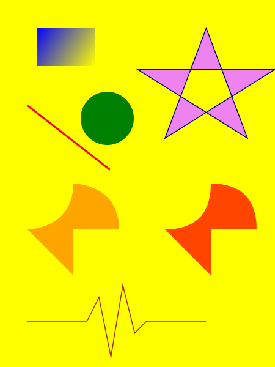

# Graphics & Animations

### Graphics

Avalonia introduces an extensive, scalable, and flexible set of graphics features that have the following benefits:

* Resolution-independent and device-independent graphics. The basic unit of measurement in the Avalonia graphics system is the device-independent pixel, which is 1/96th of an inch, regardless of actual screen resolution, and provides the foundation for resolution-independent and device-independent rendering. Each device-independent pixel automatically scales to match the dots-per-inch \(dpi\) setting of the system it renders on.
* Improved precision. The Avalonia coordinate system is measured with double-precision floating-point numbers rather than single-precision. Transformations and opacity values are also expressed as double-precision.
* Advanced graphics and animation support. Avalonia simplifies graphics programming by managing animation scenes for you; there is no need to worry about scene processing, rendering loops, and bilinear interpolation. Additionally, Avalonia provides hit-testing support and full alpha-compositing support.
* Skia. By default Avalonia uses the [Skia rendering engine](https://skia.org/), the same rendering engine that powers Google Chrome and Chrome OS, Android, Mozilla Firefox and Firefox OS, and many other products.

### 2D Shapes and Geometries

Avalonia provides a library of common vector-drawn 2D shapes such as `Ellipse`, `Line`, `Path`, `Polygon` and `Rectangle`.

```markup
<Canvas Background="Yellow" Width="300" Height="400">
    <Rectangle Fill="Blue" Width="63" Height="41" Canvas.Left="40" Canvas.Top="31">
    <Rectangle.OpacityMask>
        <LinearGradientBrush StartPoint="0%,0%" EndPoint="100%,100%">
        <LinearGradientBrush.GradientStops>
            <GradientStop Offset="0" Color="Black"/>
            <GradientStop Offset="1" Color="Transparent"/>
        </LinearGradientBrush.GradientStops>
        </LinearGradientBrush>
    </Rectangle.OpacityMask>     
    </Rectangle>
    <Ellipse Fill="Green" Width="58" Height="58" Canvas.Left="88" Canvas.Top="100"/>
    <Path Fill="Orange" Data="M 0,0 c 0,0 50,0 50,-50 c 0,0 50,0 50,50 h -50 v 50 l -50,-50 Z" Canvas.Left="30" Canvas.Top="250"/>
    <Path Fill="OrangeRed" Canvas.Left="180" Canvas.Top="250">
    <Path.Data>
        <PathGeometry>
        <PathFigure StartPoint="0,0" IsClosed="True">
            <QuadraticBezierSegment Point1="50,0" Point2="50,-50" />
            <QuadraticBezierSegment Point1="100,-50" Point2="100,0" />
            <LineSegment Point="50,0" />
            <LineSegment Point="50,50" />
        </PathFigure>
        </PathGeometry>
    </Path.Data>
    </Path>
    <Line StartPoint="120,185" EndPoint="30,115" Stroke="Red" StrokeThickness="2"/>
    <Polygon Points="75,0 120,120 0,45 150,45 30,120" Stroke="DarkBlue" StrokeThickness="1" Fill="Violet" Canvas.Left="150" Canvas.Top="31"/>
    <Polyline Points="0,0 65,0 78,-26 91,39 104,-39 117,13 130,0 195,0" Stroke="Brown" Canvas.Left="30" Canvas.Top="350"/>
</Canvas>
```



### Animation

Avalonia's animation support lets you make controls grow, shake, spin, and fade, to create interesting page transitions, and more. Avalonia uses a CSS-like animation system which supports [property transitions](https://docs.avaloniaui.net/docs/animations/transitions) and [keyframe animations](https://docs.avaloniaui.net/docs/animations/keyframe-animations).

